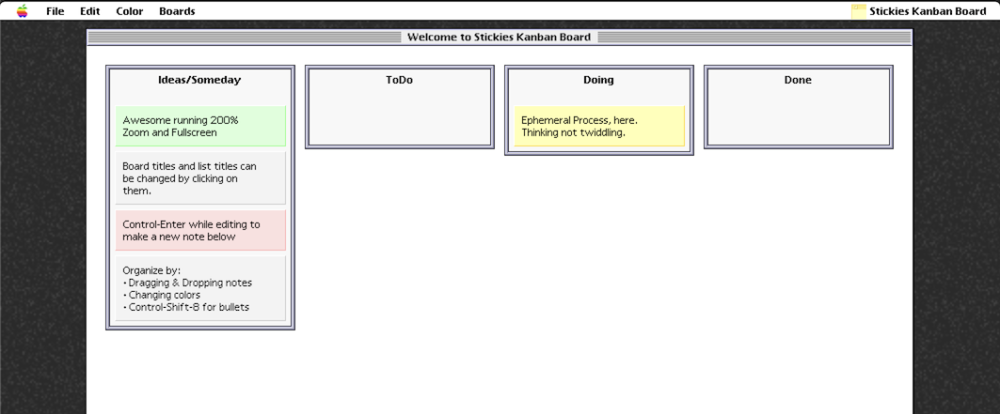

# Welcome to Stickies Kanban Board!

This is single file 'fantasy retro Mac app'. Fantasy because it's a mashup of different bits from System 7 and Mac OS 8. If you run it full screen and zoomed 200%, it can give a feel of the simplicity of pre-internet software. It's a basic/minimal kanban. Make stickies in the first column. Prioritize them and move them with satisfying drag and drop. Or color coding. 

If you set up a personal access token for github gists you can sync this to multiple computers.

### Deleting/Closing

The app maintains up to 20 board revisions for undo/redo history. Life is short, don't waste time with "Are you sure you want to delete?" messages. Deleting a board is permanent. But since this is a 'scratchpad', I think that's a reasonable simplification. More like a sheet of paper than a 'enterprise data integrity' doodad.

### GitHub Gist Sync Security

When using GitHub Gist sync:
- Personal Access Tokens are stored in localStorage (plaintext -- not secure)
- Only create tokens with `gist` scope (no repo, user, or admin access needed)
- Each device can have its own token - they should point to the same private gists

### Credits

Thanks to Nullboard: This minimalist kanban was the starting point. Slick and modern.
	https://github.com/apankrat/nullboard
	
Thanks to Espy Sans Revived: OMG, I love Espy and this recent remake is a gem.
	https://thatkeith.com/articles/espy-sans-revived/
	
Thanks to system7css (Window Title)
	https://github.com/opencoca/system7.css
	
Thanks system.css
	https://github.com/sakofchit/system.css

Thanks Mac OS 9 Platinum Sounds: I modified a single sound to make dropping feel retro.
	https://github.com/EHowardHill/Mac-OS-9-Platinum-Sounds/tree/main

Thanks to Infinite Mac: Some spots, I tried to be pixel perfect.
	https://infinitemac.org

Thanks to Jens Alfke & Apple for Stickies Application in System 7.5
