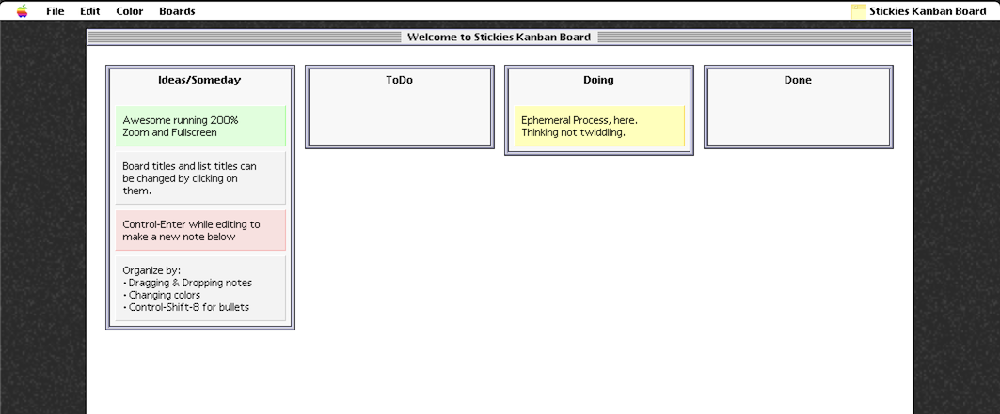

# Welcome to Stickies Kanban Board!



This is single file 'fantasy retro Mac app'. Fantasy because it's a mashup of different bits from System 7 and Mac OS 8. If you run it full screen and zoomed 200%, it can give a feel of the simplicity of pre-internet software. It's a basic/minimal kanban. Make stickies in the first column. Prioritize them and move them with satisfying drag and drop. Or color coding. 

### Resetting

This is a single-board scratchpad. The app maintains up to 20 board revisions for undo/redo history. Life is short, don't waste time with "Are you sure you want to delete?" messages. "Reset Board" wipes the board and starts fresh, and it's permanent. But since this is a 'scratchpad', I think that's a reasonable simplification. More like a sheet of paper than a 'enterprise data integrity' doodad.

### Project structure

The shipped app stays a **single, self-contained `index.html`** (all CSS, JS, and binary assets inlined as `data:` URIs) — great for sharing as one file.

Development works on **split source files** under `src/` so each piece is small enough to fit in context, with a reusable **core shell** separated from the app itself:

```
index.html          <- BUILT artifact (single file, committed)
build.py            <- assembles index.html from src/ (--app picks the app)
src/
  core/             <- REUSABLE "Mac Fantasy App" shell (MF.* namespace)
    shell.js  lib.js  util.js          Cash DOM lib + MF bootstrap
    theme/            fonts.css, tokens.css, assets/ (fonts)
    sound/            sound.js (MF.sound registry)
    menubar/          menubar.js + menubar.css (config-driven)
    window/           window.js + window.css (MF.Window / WindowManager)
  apps/
    stickies/         <- this app (composes core + its own files)
      index.html      dev shell (links core + app files)
      model.js  state.js  drag.js  varadjust.js  app.js  app.css
      assets/         app binaries (sound, favicons, desktop bg)
sw.js             <- production service worker (repo root)
tools/            <- split.py (one-off), build-diff.sh, run-tests.sh
test/             <- headless unit tests (node --test)
```

### Development workflow

Edit files under `src/`, then rebuild the single file when done:

```bash
make dev     # serve src/ locally -> http://localhost:8000/apps/stickies/index.html
make watch   # rebuild index.html automatically whenever src/ changes
make         # build index.html once from src/
make verify  # syntax-check JS, build, byte-diff guard, and headless tests
```

Or run the Python directly: `python3 build.py` (add `--watch` / `--out FILE` / `--app <app>`).

> **Note:** The production service worker (`sw.js` at the repo root) caches `./index.html`. During dev you serve `src/`, so the SW won't register there — that's expected and harmless.

When you're done, `make` and commit both the `src/` changes **and** the rebuilt single-file `index.html`, so the repo always ships the single-file artifact.

### Credits

Thanks to Nullboard: This minimalist kanban was the starting point. Slick and modern.
	https://github.com/apankrat/nullboard
	
Thanks to Espy Sans Revived: OMG, I love Espy and this recent remake is a gem.
	https://thatkeith.com/articles/espy-sans-revived/
	
Thanks to system7css (Window Title)
	https://github.com/opencoca/system7.css
	
Thanks system.css
	https://github.com/sakofchit/system.css

Thanks Mac OS 9 Platinum Sounds: I modified a single sound to make dropping feel retro.
	https://github.com/EHowardHill/Mac-OS-9-Platinum-Sounds/tree/main

Thanks to Infinite Mac: Some spots, I tried to be pixel perfect.
	https://infinitemac.org

Thanks to Jens Alfke & Apple for Stickies Application in System 7.5
